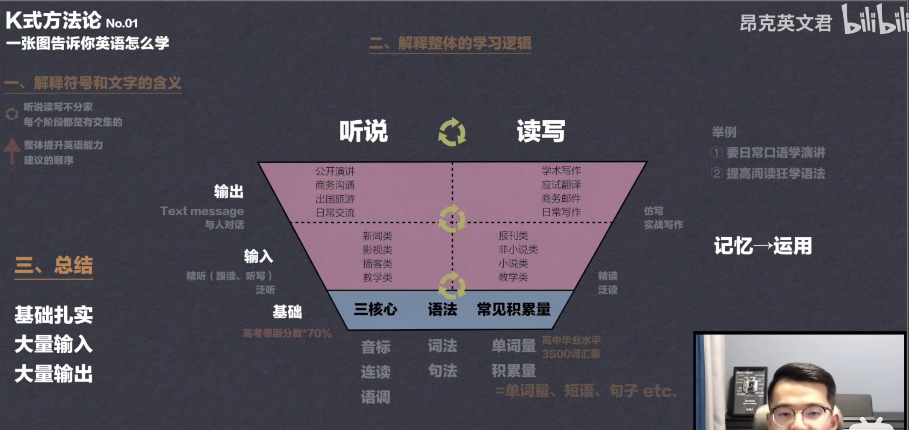

tags:: [[Language]]
alias:: [[英语]]
---

- ## 学习路线
	- 根据下面的 K 式方法论，一步步来，不着急，也不要像无头苍蝇，毫无方向地学习。
	- 音标: [[英语音标]]
	  logseq.order-list-type:: number
	- 语法: [[English Grammar]]
	  logseq.order-list-type:: number
	-
- ## 学习进度
	- [第01讲 一张图告诉你英语该怎么学 | 英语学习方法论](https://www.bilibili.com/video/BV1jE41157bX/?vd_source=f1fbb083ddef12dcff3388779faac201)
	  logseq.order-list-type:: number
		- 看完了 07 讲
		- 
	- [零基础专升本四级六级考研雅思托福GRE商务词根词缀，单词速记背单词的高效方法](https://www.bilibili.com/video/BV1tF411z7cF/)
	  logseq.order-list-type:: number
		- 词根词缀
- ## 学习资料
	- [第01讲 一张图告诉你英语该怎么学 | 英语学习方法论](https://www.bilibili.com/video/BV1jE41157bX/?vd_source=f1fbb083ddef12dcff3388779faac201)
	  logseq.order-list-type:: number
	- logseq.order-list-type:: number
- ## 如何学习
	- 先学音标: [[英语音标]]
	  logseq.order-list-type:: number
	- 整体把握语法，不要求全面，不懂再查阅。
	  logseq.order-list-type:: number
	- 英语内容输入
	  logseq.order-list-type:: number
		- 英语文档: 补充专业内容语料
		  logseq.order-list-type:: number
		- 英文影视剧/小说: 补充日常对话语料。
		  logseq.order-list-type:: number
	- 输出
	  logseq.order-list-type:: number
		- 针对某一话题，准备相关表达。
		  logseq.order-list-type:: number
		- 写英文日记
		  logseq.order-list-type:: number
		- 上 HelloTalk 或其他语音方式与母语人士聊天。
		  logseq.order-list-type:: number