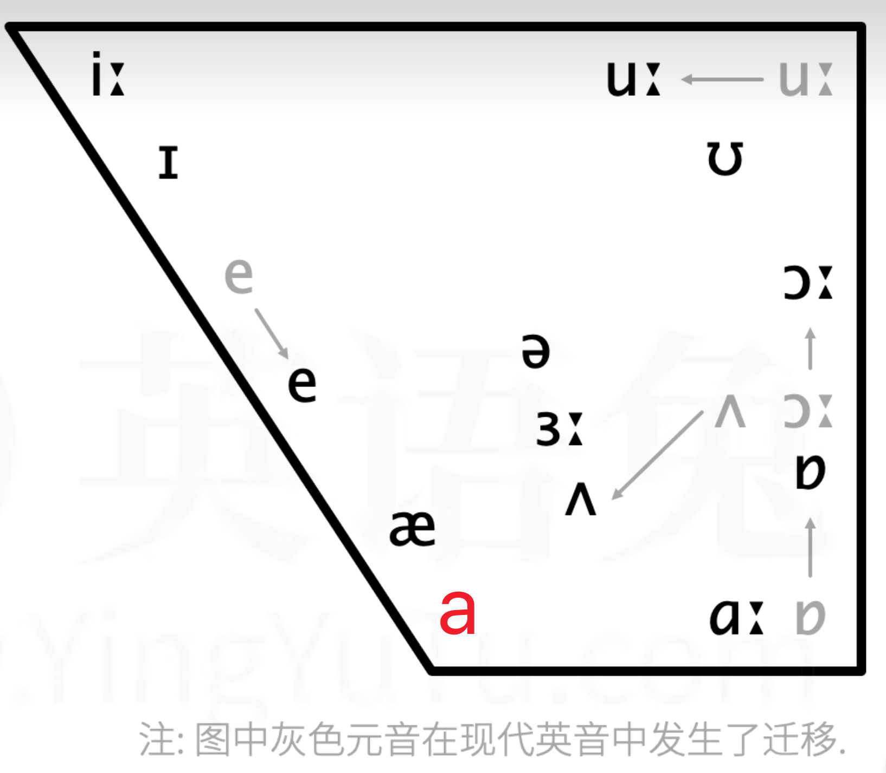

tags:: [[英语音标]]
---

- ## 按气流方向分类
	- 人类发音与气流密切相关.
	- 向外吐气 发出的声音被称为 **外呼音** .
		- 如: 正常说话
	- 向内吸气 发出的声音被称为 **内呼音** .
		- 如: 倒吸一口凉气发出的“啊”
	- 人类发内呼音的情况较少，下面将主要讨论 **外呼音** .
- ## 外呼音发音过程
	- 1、气流由肺部挤压, 一路上行 .
	- 2、气流首先来到声门 (即两瓣声带的开口处, ((baa7ed03-b34d-4bfc-92d6-70651ec0c14e))) .
		- 如果选择 **不振动声带**, 则会发出 **清音 (voiceless sound)** .
			- 比如 [哈出一口气] 也会发出声音, 只不过不是由 **声带振动** 产生的 .
		- 如果选择 **振动声带**, 则会发出 **浊音 (voiced sound)** .
	- 3、气流离开声门, 来到 口腔 和 鼻腔处 .
		- 鼻腔
			- 可以控制气流是否通过 **鼻腔** .
		- 软腭, 小舌 可以参与发音 .
		- 舌头
			- 可以通过 **抬高降低** , 改变气流通行 .
			- 可以通过 **接触** 口腔的不同位置 (如齿, 齿龈, 硬腭), 阻碍气流通行 .
		- 嘴唇
			- 可以通过 **张开闭合** , 控制气流通行 .
		- 气流通过口腔时, **不受阻碍** 发出的音, 被称为 **元音/母音 (vowels)** .
		- 气流通过口腔时, **在部分时间或全部时间受到阻碍** 发出的音, 被称为 **辅音/子音 (consonants)** .
			- 可以通过 **舌头与口腔其他部位接触** 或 **闭拢嘴唇** 阻碍气流 .
	- 4、气流离开人体, 一个音的发音过程结束 . 可以继续发下一个音 .
- ## 清浊元辅排列组合
	- 由发音过程可得如下表格:
		- |    | 不阻碍气流   | 阻碍气流   |
		  | ---- | ---- | ---- |
		  | 不振动声带     | <s>清元音</s>    | 清辅音     |
		  | 振动声带     | 浊元音     | 浊辅音     |
	- **清元音** 比较少见, 所以一般粗略地认为元音只有 **浊元音** .
- ## 元音三要素
	- 由于发元音时不阻碍气流，所以影响元音的要素很少，主要是我们的 **舌头** 和 **嘴唇** .
	- 元音三要素是:
		- 圆唇度 (roundness )
			- 即嘴唇圆的程度 .
			- {:height 297, :width 198}
		- 舌位高低 (height)
			- **舌位** 即 发音时舌头隆起的最高点 .
			- 舌头抬高舌位就高, 舌头降低舌位就低 .
			- {:height 297, :width 198}
		- 舌位前后 (backness)
			- **舌位** 即 发音时舌头隆起的最高点 .
			- 舌头前伸舌位就前, 舌头后缩舌位就后 .
			- {:height 297, :width 198}
	- 另外, **舌位高低** 和 **舌位前后** 会影响嘴巴的 **开口度** (即嘴巴张开的大小, 注意, 与 **圆唇度** 不同) .
	- 所以 **开口度** 可以间接判断一个元音对不对, 但并不可靠, 还是应该以上述三要素为主 .
- ## 元音图 (Vowel Digram / Vowel Chart)
	- {:height 189, :width 229}
	- 其中 `a` 并非一个单独的元音，它是几个 **双元音** 前半部分的发音。
	- 元音在元音图的左右相对位置，表示舌位的前后相对位置；元音在元音图的上下相对位置，表示舌位的高低相对位置。
	- 之所以上宽下窄，是因为高元音的舌位前后差别，大于低元音的舌位前后差别。
	- 如果有元音舌位相同，只是圆唇度不同，则可以按 `不圆唇 圆唇` 并排放置。
		- {:height 189, :width 229}
- ## DJ 音标 (IPA88) 发音技巧
	- ### 元音
		- ɪ : 类似军训中的 **一二一** 的 **yi** .
		- æ : 是 a 过度到 e 的音，用 a 的口型去发 e .
		- ʌ , a, ɑː 的区别:
			-
- ---
- ## 参考
	- [英语兔 - 全网最适合中国人的免费音标课(纯干货, 超详细!) - (P4 - P6)](https://www.bilibili.com/video/BV1iV411z7Nj?p=4&vd_source=f1fbb083ddef12dcff3388779faac201)
	-