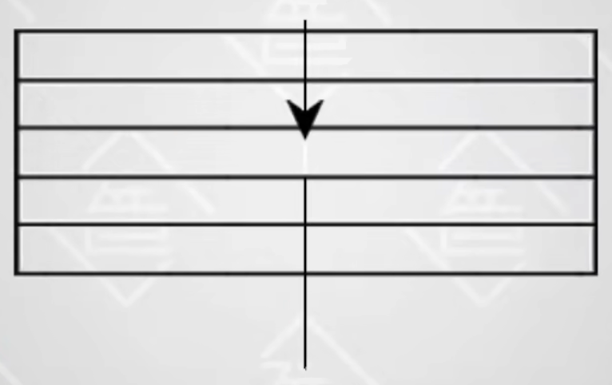
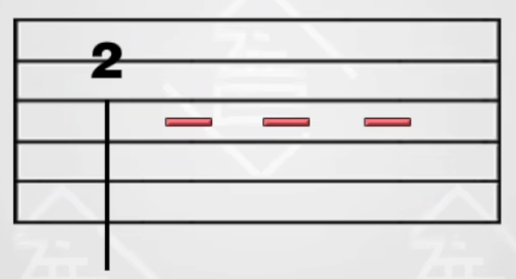

## 和弦图
	- {:height 254, :width 213}
	- 从左到右的竖线，分别表示 6 - 1 弦。
	- 从上到下的横线 (从第二条开始) 表示品丝，横线之间的区域即品格，从上到下即是 1 - 3 品 (有些和弦图会有 4 品) 。
	- 黑点所在的地方，即表示我们手指需要按的地方。
- ## 小节
	- 六线谱由一个个竖线分隔的 `小节` 组成。
	- 六线谱横线从上到下分别代表吉他的 1- 6 弦。
	- {:height 100, :width 583}
- ## 音符结构
	- 每一 `小节` 都由若干 `音符` 组成 。
	- {:height 97, :width 253}
	- 每个 `音符` 都由如下几部分构成：
		- 符头
		  logseq.order-list-type:: number
			- 表示怎么弹/怎么按
		- 符干
		  logseq.order-list-type:: number
			- 一条符干代表一个音符
		- 符尾
		  logseq.order-list-type:: number
			- 符尾表示这个音符是 `几分音符` 。
		- {:height 261, :width 224}
- ## 符头
	- ### 符头为 X
		- 表示当前音符要在按住当前小节和弦的前提下弹奏。
			- {:height 242, :width 202}
		- 如果当前小节有两个和弦，若无特殊标识，则需要按当前小节拍子总量，将音符平均分成两组，第一组按第一个和弦， 第二组按第二个和弦。
	- ### 符头为数字
		- 表示弹奏此音符时，左手需要按住的品数。
		- {:height 141, :width 237}
	- ### 符头为箭头
		- 表示 `扫弦` 。
		- 如下为从 6 弦扫到 3 弦。
			- {:height 140, :width 238}
		- 如下为从 1 弦扫到 3 弦。
			- {:height 185, :width 239}
- ## 符尾 (几分音符)
	- ### 4 分音符
		- 没有符尾
		- {:height 144, :width 263}
	- ### 8 分音符
		- 符尾带 一个勾 或 一条横线 (用于连接多个 8 分音符) 。
		- {:height 144, :width 263}
		- {:height 144, :width 263}
	- ### 16 分音符
		- 符尾带 两个勾 或 两条横线 (用于连接多个 16 分音符) 。
		- {:height 144, :width 263}
		- {:height 144, :width 263}
	- ### 2 分音符
		- 4 分音符右侧加 1 条短横线 (称为增时线) 。
		- {:height 144, :width 263}
	- ### 全分音符
		- 4 分音符右侧加 3 条短横线 (称为增时线) 。
		- {:height 144, :width 263}
- ## 拍子
	- ### 谱子的拍子类型
		- 两种最常见的拍子类型: 八六拍 和 四四拍
			- {:height 91, :width 45}
			- {:height 91, :width 45}
		- 分母: 表示谱子以几分音符为一拍。
		- 分子: 表示每个小节有几拍。
	- ### 各音符的拍数
		- 全音符的拍数，即为上述拍子类型的 `分母` 。
		- 几分音符的拍数，即为全音符拍数的几分之一。
		- 举例：
			- {:height 229, :width 232}
			- {:height 229, :width 232}
- ## 打拍子
	-
- ## 参考
	- [B 站 - 吉他大学霸 - 基础乐理](https://www.bilibili.com/video/BV1XS4y1M7Sq/?p=4)
	  logseq.order-list-type:: number
	- logseq.order-list-type:: number