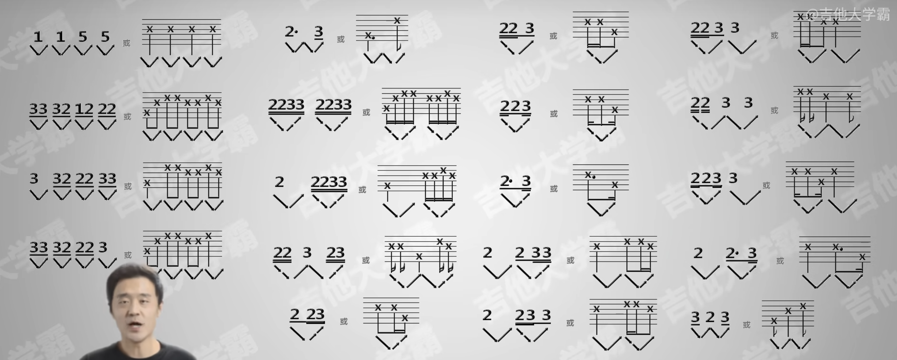

tags:: [[Guitar]]
---

- ## 总览
	- {:height 375, :width 955}
	- 总体分为四类:
		- 四分与八分音符组合
		  logseq.order-list-type:: number
		- 四分与十六分音符组合
		  logseq.order-list-type:: number
		- 八分与十六分音符组合
		  logseq.order-list-type:: number
		- 四分八分与十六分音符组合
		  logseq.order-list-type:: number
- ## 参考
	- [【超详细-入门必看防弯路】19种常用音符组合节奏视唱讲解 看完任何谱子各种节奏音符就都会了 保姆级全套识谱节奏感节拍子乐理吉他基础强化识谱练习 正确乐感养成](https://www.bilibili.com/video/BV1894y1R7HR?vd_source=f1fbb083ddef12dcff3388779faac201)
	  logseq.order-list-type:: number
	- logseq.order-list-type:: number