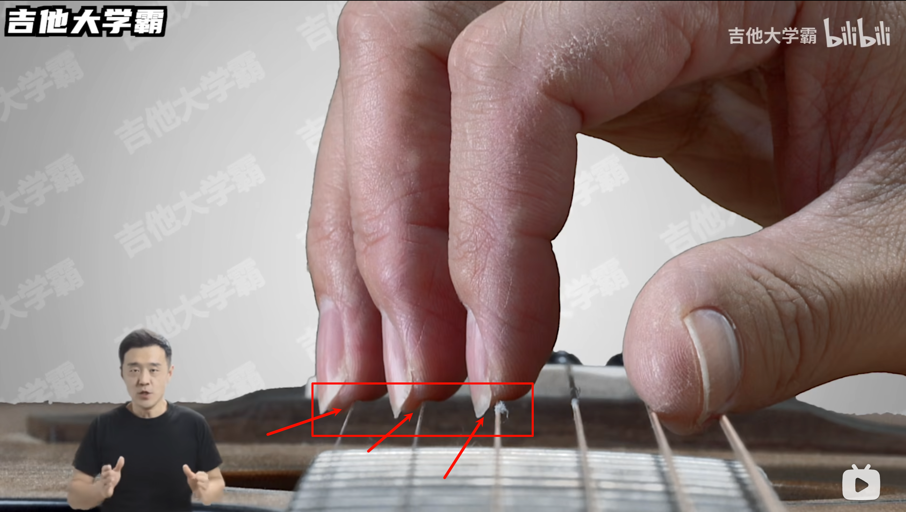

tags:: [[Guitar]]
---

- ## 吉他与身体的相对位置
	- ### 吉他与大腿的夹角 (侧视图)
	  id:: 6846eec9-bcec-4aef-8a4f-c30cb549f850
		- 吉他与大腿夹角在 100 - 110 度左右, 向上半身倾斜.
		- {:height 395, :width 542}
		  id:: 6846ef46-bb06-4184-8e04-dcea3786a76d
	- ### 吉他与上身的夹角 (俯视图)
		- 吉他与上身有个夹角 (图中感觉没有 60 度, 大概 40 度左右), 指向左前方.
		- {:height 395, :width 542}
	- ### 吉他与水平面的夹角 (正视图)
		- 吉他与水平面保持平行, 或微微向左上方翘起, 与水平面保持 20 度左右的夹角.
		- {:height 395, :width 542}
- ## 右手姿势
	- ### 拇指姿势
		- 用拇指 `第一关节侧面` 以 `10-40 度` 的角度, 放在琴弦 `外侧面的上半部分`.
		  logseq.order-list-type:: number
			- {:height 395, :width 542}
			- {:height 491, :width 621}
		- 拇指负责 6, 5, 4 弦, 拇指与每根弦都是保持这个姿势.
		  logseq.order-list-type:: number
	- ### 食指中指无名指姿势
		- 三根手指第二关节弯曲, 第一关节放松伸直, 让三根手指垂直于琴弦
		  logseq.order-list-type:: number
			- {:height 395, :width 542}
		- 食指, 中指, 无名指 分别放在 3, 2, 1 弦 `外侧面的下半部分`.
		  logseq.order-list-type:: number
			- {:height 395, :width 542}
		- 让食指看起来在拇指第一个关节正下方
		  logseq.order-list-type:: number
			- {:height 395, :width 542}
	- ### 手掌手腕姿势
		- 确保我们最多只能看到中指的第三关节 (而看不到无名指和小指).
		  logseq.order-list-type:: number
			- {:height 395, :width 542}
		- 手掌可以和小臂连成一条线, 也可以让手腕稍微向左上方弯曲
		  logseq.order-list-type:: number
			- {:height 395, :width 542}
			- {:height 395, :width 542}
	- ### 小指姿势
		- 小指可以靠在面板上, 也可以放松悬空
		- {:height 395, :width 542}
		- {:height 395, :width 542}
- ## 四个点
	- 吉他腰部凹陷的地方，放在右腿根部。
	  logseq.order-list-type:: number
	- 吉他背面贴在右胸口。
	  logseq.order-list-type:: number
	- 吉他尾部最高点用来放右手肘关节。
	  logseq.order-list-type:: number
	- 左手虎口卡在吉他琴颈的第一格。
	  logseq.order-list-type:: number
- ## 两个自然放松
	- 右手 **手臂、手腕、手背、手指** 全部自然放松。
	  logseq.order-list-type:: number
		- **手腕** 不要 **拱起** ，也不要 **折下去** 。
	- 左手 **手腕、手臂** 自然放松。
	  logseq.order-list-type:: number
		- **手腕** 要 **自然下垂**
		- **手臂** 不要 **向外抬起来** ，也不要 **向身体靠拢** 。
- ## 一个正中
	- 右手手指 正好放在音孔正中的区域。
- ## 参考
	- [【超详细-入门必看防弯路】吉他右手拨弦正确手型姿势教学 (P6)](https://www.bilibili.com/video/BV1Yt4y1W7uq?vd_source=f1fbb083ddef12dcff3388779faac201)
	  logseq.order-list-type:: number