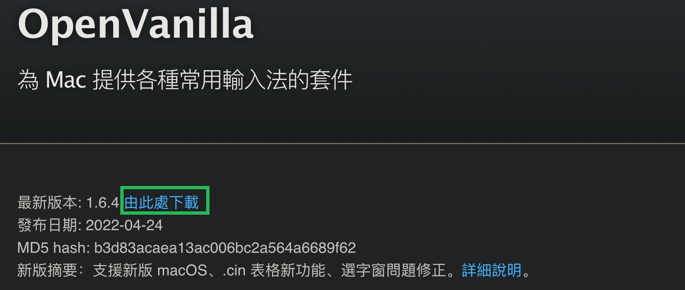
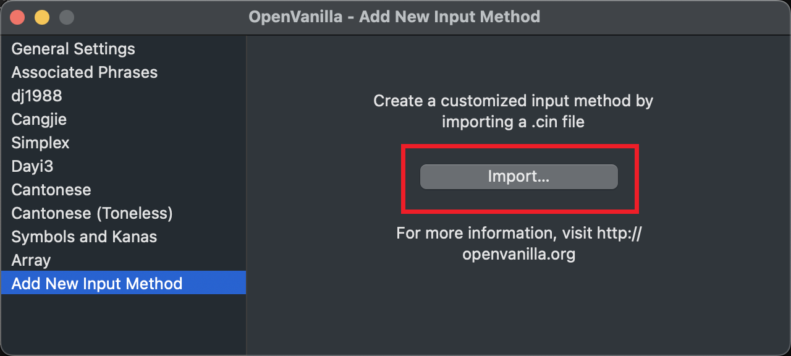
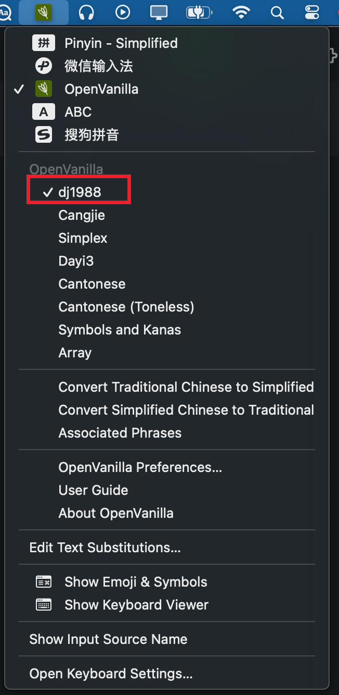

tags:: [[英语音标]]
---

- ## 使用 OpenVanilla
	- 说白了，这个工具就是让我们可以自定义键盘的每个键可以打出哪些字符。
	- [无脑下载和安装 OpenVanilla](https://openvanilla.org/)
	  logseq.order-list-type:: number
		- {:height 230, :width 522}
	- 进入设置页面。
	  logseq.order-list-type:: number
		- {:height 114, :width 261}
	- 参照 [刪除、修改與設計自己的輸入法](https://github.com/openvanilla/openvanilla/blob/master/CinHowTo.markdown) 编写 `xxx.cin`  文件
	  logseq.order-list-type:: number
		- ``` cin
		  %gen_inp
		  %ename dj1988
		  %cname dj1988
		  %encoding UTF-8
		  %selkey 1234567890
		  %keyname begin
		  a a
		  b b
		  c c
		  d d
		  e e
		  f f
		  g g
		  h h
		  i i
		  j j
		  k k
		  l l
		  m m
		  n n
		  o o
		  p p
		  q q
		  r r
		  s s
		  t t
		  u u
		  v v
		  w w
		  x x
		  y y
		  z z
		  1 1
		  2 2
		  3 3
		  4 4
		  5 5
		  6 6
		  7 7
		  8 8
		  9 9
		  0 0
		  0 ∅
		  \ \
		  ; ;
		  ' '
		  / /
		  . .
		  ` `
		  = =
		  [ [
		  - -
		  , ,
		  %keyname end
		  %chardef begin
		  a; ɑ:
		  a ʌ
		  a æ
		  ai aɪ
		  au aʊ
		  b b
		  d d
		  dg dʒ
		  dr dr
		  dz dz
		  e; ɜ:
		  e ə
		  e e
		  ei eɪ
		  ee eə
		  eu əʊ
		  f f
		  g g
		  h h
		  i; i:
		  i ɪ
		  ie ɪə
		  j j
		  k k
		  l l
		  m m
		  n n
		  n ŋ
		  o; ɔ:
		  o ɒ
		  oi ɔɪ
		  p p
		  r r
		  s s
		  t t
		  th θ
		  th ð
		  tx tʃ
		  tr tr
		  ts ts
		  u; u:
		  u ʊ
		  ue ʊə
		  v v
		  w w
		  x ʃ
		  x ʒ
		  z z
		  qo ɔ
		  qe ɛ
		  qe ɜ
		  qe ɛɜ
		  qe ɛr
		  qr ɚ
		  qr ɜr
		  #######常见两音标组合
		  an ʌn
		  an æn
		  am ʌm
		  ek ək
		  di dɪ
		  dx dʒ
		  en ən
		  em əm
		  er ər
		  eu əu
		  fe fə
		  ga gæ
		  hi hɪ
		  ke kə
		  ik ɪk
		  in ɪn
		  in ɪŋ
		  ir ɪr
		  kj kjʊ
		  la lʌ
		  la læ
		  le lə
		  le lɛ
		  li lɪ
		  me mə
		  mo mɒ
		  ne nə
		  ni nɪ
		  ou oʊ
		  pa pæ
		  ra ræ
		  ra rʌ
		  re rə
		  ri rɪ
		  sa sʌ
		  se sə
		  si sɪ
		  so sɒ
		  ta tæ
		  ta tʌ
		  te tə
		  ti tɪ
		  to tɒ
		  ue uə
		  ve və
		  xn ʃn
		  xl ʃl
		  / /
		  , ʼ
		  , ʻ
		  , ː
		  , ʽ
		  , ,
		  - ̠
		  - ̝
		  - ̞
		  - ̘
		  - ̙
		  = ̟
		  [ ̪
		  [ ̺
		  0 ̜
		  0 ̹
		  ' '
		  '  ̩
		  \  ̯
		  . .
		  . ̬
		  . ̥
		  1 ̀
		  1 ˨
		  %chardef end:
		  ```
	- 导入 `.cin` 文件。
	  logseq.order-list-type:: number
		- {:height 187, :width 612}
	- 在需要输入音标时，切换到 `OpenVanilla` ，再选择我们自定义的输入法即可。
	  logseq.order-list-type:: number
		- {:height 399, :width 191}
		-
- ## 各音标体系示例
	- 来自: [英语音标和Unicode](http://www.fmddlmyy.cn/text65.html)
	- |  | 示例单词 | IPA63 | IPA63示例 | IPA88 | IPA88示例 | KK | KK示例 | Collins | Collins示例 |
	  | 单元音短元音 | sit | i | [sit] | ɪ | [sɪt] | ɪ | [sɪt] | ɪ | /sɪt/ |
	  |  | about | ə | [əˈbaut] | ə | [əˈbaʊt] | ə | [əˈbaʊt] | ə | /əbaʊt/ |
	  |  | forget |   | [fəˈget] |   | [fəˈget] |   | [fəˈgɛt] | ər | /fərget/ |
	  |  | hot | ɔ | [hɔt] | ɒ | [hɒt] | ɑ | [hɑt] | ɒ | /hɒt/ |
	  |  | good | u | [gud] | ʊ | [gʊd] | ʊ | [gʊd] | ʊ | /gʊd/ |
	  |  | luck | ʌ | [lʌk] | ʌ | [lʌk] | ʌ | [lʌk] | ʌ | /lʌk/ |
	  |  | yes | e | [jes] | e | [jes] | ɛ | [jɛs] | e | /jes/ |
	  |  | man | æ | [mæn] | æ | [mæn] | æ | [mæn] | æ | /mæn/ |
	  | 单元音长元音 | week | i: | [wi:k] | i: | [wi:k] | i | [wik] | i: | /wi:k/ |
	  |  | very |   | [ˈveri:] |   | [ˈveri:] |   | [ˈvɛri] | i | /veri/ |
	  |  | turn | ə: | [tə:n] | ɜ: | [tɜ:n] | ɜ | [tɜn] | ə:r | /tə:rn/ |
	  |  | claw | ɔ: | [klɔ:] | ɔ: | [klɔ:] | ɔ | [klɔ] | ɔ: | /klɔ:/ |
	  |  | floor |   | [flɔ:r] |   | [flɔ:r] |   | [flɔr] | ɔ:r | /flɔ:r/ |
	  |  | school | u: | [sku:l] | u: | [sku:l] | u | [skul] | u: | /sku:l/ |
	  |  | actual |   | [ˈæktʃuəl] |   | [ˈæktʃʊəl] |   | [ˈæktʃuəl] | u | /æktʃuəl/ |
	  |  | calm | ɑ: | [kɑ:m] | ɑ: | [kɑ:m] | ɑ | [kɑm] | ɑ: | /kɑ:m/ |
	  |  | card |   | [kɑ:d] |   | [kɑ:d] |   | [kɑd] | ɑ:r | /kɑ:rd/ |
	  | 双元音 | say | ei | [sei] | eɪ | [seɪ] | e | [se] | eɪ | /seɪ/ |
	  |  | bike | ai | [baik] | aɪ | [baɪk] | aɪ | [baɪk] | aɪ | /baɪk/ |
	  |  | boy | ɔi | [bɔi] | ɔɪ | [bɔɪ] | ɔɪ | [bɔɪ] | ɔɪ | /bɔɪ/ |
	  |  | house | au | [haus] | aʊ | [haʊs] | aʊ | [haʊs] | aʊ | /haʊs/ |
	  |  | coat | əu | [kəut] | əʊ | [kəʊt] | o | [kot] | oʊ | /koʊt/ |
	  |  | dear | iə | [diə] | ɪə | [dɪə] | ɪr | [dɪr] | ɪər | /dɪər/ |
	  |  | care | ɛə | [kɛər] | eə | [keər] | ɛr | [kɛr] | eər | /keər/ |
	  |  | tour | uə | [tuər] | ʊə | [tʊər] | ʊr | [tʊr] | ʊər | /tʊər/ |
	  | 清辅音 | pay | p | [pei] | p | [peɪ] | p | [pe] | p | /pei/ |
	  |  | talk | t | [tɔ:k] | t | [tɔ:k] | t | [tɔk] | t | /tɔ:k/ |
	  |  | king | k | [kiŋ] | k | [kɪŋ] | k | [kɪŋ] | k | /kiŋ/ |
	  |  | fit | f | [fit] | f | [fɪt] | f | [fɪt] | f | /fɪt/ |
	  |  | thin | θ | [θin] | θ | [θɪn] | θ | [θɪn] | θ | /θɪn/ |
	  |  | bus | s | [bʌs] | s | [bʌs] | s | [bʌs] | s | /bʌs/ |
	  |  | ship | ʃ | [ʃip] | ʃ | [ʃɪp] | ʃ | [ʃɪp] | ʃ | /ʃɪp/ |
	  |  | cheap | tʃ | [tʃi:p] | tʃ | [tʃi:p] | tʃ | [tʃip] | tʃ | /tʃi:p/ |
	  | 浊辅音 | bed | b | [bed] | b | [bed] | b | [bɛd] | b | /bed/ |
	  |  | done | d | [dʌn] | d | [dʌn] | d | [dʌn] | d | /dʌn/ |
	  |  | dog | ɡ | [dɔɡ] | ɡ | [dɒɡ] | ɡ | [dɑɡ] | ɡ | /dɒɡ/ |
	  |  | voice | v | [vɔis] | v | [vɔɪs] | v | [vɔɪs] | v | /vɔɪs/ |
	  |  | then | ð | [ðen] | ð | [ðen] | ð | [ðɛn] | ð | /ðen/ |
	  |  | buzz | z | [bʌz] | z | [bʌz] | z | [bʌz] | z | /bʌz/ |
	  |  | measure | ʒ | [ˈmeʒə] | ʒ | [ˈmeʒə] | ʒ | [ˈmɛʒə] | ʒ | /meʒər/ |
	  |  | bridge | dʒ | [bridʒ] | dʒ | [brɪdʒ] | dʒ | [brɪdʒ] | dʒ | /brɪdʒ/ |
	  | 其它辅音 | home | h | [həum] | h | [həum] | h | [hom] | h | /houm/ |
	  |  | mat | m | [mæt] | m | [mæt] | m | [mæt] | m | /mæt / |
	  |  | not | n | [nɔt] | n | [nɒt] | n | [nɑt] | n | /nɒt/ |
	  |  | hidden |   | [ˈhidn] |   | [ˈhɪdn] |   | [ˈhɪdn] | ən | /hɪdən/ |
	  |  | sing | ŋ | [siŋ] | ŋ | [sɪŋ] | ŋ | [sɪŋ] | ŋ | /sɪŋ/ |
	  |  | late | l | [leit] | l | [leɪt] | l | [leɪt] | l | /leɪt/ |
	  |  | handle |   | [ˈhændl] |   | [ˈhændl] |   | [ˈhændl] | əl | /hændəl/ |
	  |  | run | r | [rʌn] | r | [rʌn] | r | [rʌn] | r | /rʌn/ |
	  |  | you | j | [ju:] | j | [ju:] | j | [ju] | j | /ju:/ |
	  |  | win | w | [win] | w | [wɪn] | w | [wɪn] | w | /wɪn/ |
	  |  | why |   | [hwai] |   | [hwaɪ] |   | [hwaɪ] | hw | /hwaɪ/ |
- ## 参考
	- [Mac 下有什么好用的国际音标输入法呢？ - 董鹏的回答 - 知乎](https://www.zhihu.com/question/31688158/answer/71804046)
	  logseq.order-list-type:: number
	- [Mac 下有什么好用的国际音标输入法呢？ - sodino的回答 - 知乎](https://www.zhihu.com/question/31688158/answer/1753401922)
	  logseq.order-list-type:: number
	  id:: 6623585f-0a18-4a3a-be8b-754b24672696
	- [英语音标和Unicode](http://www.fmddlmyy.cn/text65.html)
	  logseq.order-list-type:: number
	- [英语音标输入（吕陶然）](http://www.fmddlmyy.cn/yinbiao/)
	  logseq.order-list-type:: number
	- logseq.order-list-type:: number