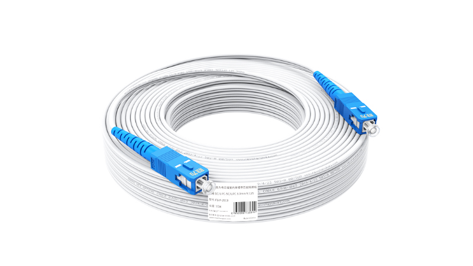

tags:: [[Shopping]]
---

- ## 宽带安装步骤
	- 联系运营商客服/营业厅/代理商办理宽带
	  logseq.order-list-type:: number
	- 师傅上门安装宽带, 室内会安装一个调制解调器(猫)
	  logseq.order-list-type:: number
		- 猫可能也有 wifi 功能, 但不太好用
		- 可能也会附赠路由器
	- 安装路由器.
	  logseq.order-list-type:: number
	- ==如果要搬家, 记得注销宽带, 或办理移机.==
- ## 种类
	- 大体分为两种:
		- 单宽带: 
		  logseq.order-list-type:: number
			- 只办宽带, 无需绑卡
			  logseq.order-list-type:: number
			- 按年缴费
			  logseq.order-list-type:: number
		- 融合宽带
		  logseq.order-list-type:: number
			- 办理时需要绑卡并选择套餐.
			  logseq.order-list-type:: number
			- 按月缴费
			  logseq.order-list-type:: number
- ## 网速
	- 500M 宽带网速不是 500M/s, 而是 500Mbps, 即 500/8=62.5M/s.
	- 而这个也只是理论最高速度, 并非实际速度.
- ## 光纤到用户侧的模式
	- 参考: [FTTH入户光纤：实现高速宽带和无限潜力](https://www.newshengwei.com/newshow-551.html)
	- 这些模式统称为 `FTTx` ,
	- 如下几种和普通家庭用户有关, 从上到下网络更好, 不同的模式, 采用的线材可能不同:
		- FTTB: Fiber To The Building，光纤到楼 (趋于淘汰)
		- FTTH: Fiber To The Home，光纤到户
			- {:height 344, :width 499}
			- 理论上, 带宽可达 ​**​100Gbps**
		- FTTR: Fiber To The Room，光纤到室
- ## 运营商
	- 三大运营商特点:
		- 电信: 稳定性高, 价格高
		- 联通: 稳定性中, 价格中
		- 移动: 稳定性低, 价格低
	- 需要咨询小区物业, 知道各大运营商宽带是否覆盖你所在区域.
- ## 选购渠道
	- 如下:
		- 官方客服
		  logseq.order-list-type:: number
		- 官方营业厅
		  logseq.order-list-type:: number
		- 代理营业厅
		  logseq.order-list-type:: number
		- 代理商
		  logseq.order-list-type:: number
- ## 费用
	- 一般如下几种费用:
		- 宽带费
		  logseq.order-list-type:: number
		- 安装费
		  logseq.order-list-type:: number
		- 设备费
		  logseq.order-list-type:: number
		- 移机费 (将宽带移到新房)
		  logseq.order-list-type:: number
- ## 关于 IPv6
	- 参考:
		- [江苏镇江移动停用 ipv6](https://www.v2ex.com/t/1029647)
		  logseq.order-list-type:: number
		- [移动关闭我的了 ipv6 功能](https://www.v2ex.com/t/1039440)
		  logseq.order-list-type:: number
- ## 宽带测速
	- SpeedTest APP (注意：不要和测速网搞混了，另外好像网站测得不太准，建议用 APP 测)
	  logseq.order-list-type:: number
	- 全球网测 APP （中国信通院出品，有个城市各运营商的测速节点）
	  logseq.order-list-type:: number
	- 花瓣测速 APP (好像没有 iOS 版)
	  logseq.order-list-type:: number
- ## 需要确定的问题
	- ### 选购
		- 咨询所在小区/城中村, 可以办理哪些运营商? (咨询官方客服或者物业)
		  logseq.order-list-type:: number
		- 选择运营商.
		  logseq.order-list-type:: number
		- 确定所需网速.
		  logseq.order-list-type:: number
	- ### 安装
		- 安装费用多少?
		  logseq.order-list-type:: number
		- 是否有设备费用?
		  logseq.order-list-type:: number
		- 注销时是否需要归还设备? (猫和路由器)
		  logseq.order-list-type:: number
		- 办理移机多少钱?
		  logseq.order-list-type:: number
- ## 一些优惠宽带
	- [中国联通 (刀哥)](https://landing.haokazhijia.net/dist/?content_value=BV1SiUdYiE4z&content_type=video#/?sell=MTQyOQ&video_id=&qrcode=&order_type=29) (来自: [【宽带推荐】线上宽带套餐，便宜到你不敢想象！](https://www.bilibili.com/video/BV1SiUdYiE4z/?vd_source=f1fbb083ddef12dcff3388779faac201))
	  logseq.order-list-type:: number
	- [全国宽带预约 (宽带老舅)](https://gaoneng.bilibili.com/tetris/page/?pageId=977939939051515904&track_id=__CMFROMTRACKID__&content_value=BV1z95szWEtw&content_type=video&mid=308255248&buvid=555F4D83-698C-9F61-B6EE-6B2B62BD50FB88308infoc&allow_history=0) (来自: [如何办理宽带不被营业厅坑？](https://www.bilibili.com/video/BV1z95szWEtw/?vd_source=f1fbb083ddef12dcff3388779faac201))
	  logseq.order-list-type:: number
	- [广东联通宽带 5G](https://mi.qiangka.com/gather/?content_value=BV1KR8Cz8EBt&content_type=video#/pages/indexmuch/indexmuch?codedata=ltkdgd5g&code=bili-jqy) (来自: [【宽带干货】全国低价宽带安装攻略](https://www.bilibili.com/video/BV1KR8Cz8EBt/?vd_source=f1fbb083ddef12dcff3388779faac201))
	  logseq.order-list-type:: number
	- (来自: [【宽带测评】书老师小课堂开课了](https://www.bilibili.com/video/BV1mqtFzNENQ/?vd_source=f1fbb083ddef12dcff3388779faac201))
	  logseq.order-list-type:: number