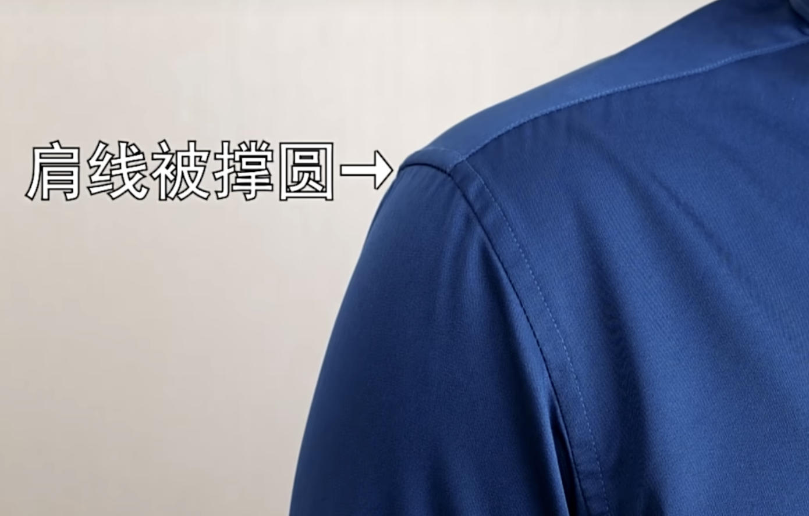

tags:: [[服装选购]]
---

- ## 胸围
	- `衣服胸围` 代表了一件衣服的 `宽松度` .
	- `身材胸围` 的测量方法: 找到胸部最宽的位置绕一圈.
	- ### 上衣的号型
		- 参考: [中国国家标准 - 服装号型 男子 (GB/T 1335.1-2008)](https://openstd.samr.gov.cn/bzgk/gb/newGbInfo?hcno=EC87D6B2262ABDCFD055989D2C9DCC9F)
		- 如 `165/84A/S`
			- 165 代表 `适合的身高`
			- 84 代表 `衣服胸围`
			- 84 跟着的字母代表衣服类型:
				- A: 标准型
				- B: 微胖型
				- C: 肥胖型
				- Y: 瘦型
				- ==不过, 现在 `A` 基本上一统江湖了==
		- 
	- ### 上衣胸围与身材胸围
		- 
- ## 肩宽
	- `身材肩宽` 测量时要经过颈椎, 不是两边肩膀直接拉直.
		- {:height 269, :width 734}
	- 如果属于漂亮的 `直角肩`:
		- `衣服肩宽` 可以选和 `身材肩宽` 相等的, 这被称为 `正肩`, 穿上去利落有棱角
	- 如果不属于漂亮的 `直角肩`:
		- `衣服肩宽` 可以选大于 `身材肩宽` 2cm 的;
		- 否则如果选`衣服肩宽` 和 `身材肩宽` 相等的, 肩线容易撑圆, 不好看.
			- {:height 212, :width 334}
		- `衣服肩宽` 如果比 `身材肩宽` 大 10cm 以上, 则称为 `落肩` , 穿上会比较轻松随意.
	- 瘦人想要撑气场的话, 也可以选择肩宽稍宽一些的硬挺面料.
- ## 袖长与臂长
	- ### 测量臂长
		- 从 `肩膀` 量到 `手腕骨`
			- {:height 344, :width 386}
	- ### 衣服袖长选择
		- `袖口超过手腕骨的长度` = `(1/2 衣服肩宽 + 袖长) - (1/2 身材肩宽 + 臂长) - 面料硬度导致不贴身的长度`
			- `袖口超过手腕骨的长度` = 0 , 表示袖口刚好到手腕骨
			- `袖口超过手腕骨的长度` > 0 , 表示袖口超过手腕骨, 到手掌了.
		- 
- ## 肚围与短款上衣的下摆围
	- ### 测量肚围
		- 肚子最突出的地方量一圈.
	- ### 下摆围选择
		- {:height 273, :width 431}
		- 如果选短款上衣, 要选下摆围和肚围接近的.
- ## 腰围
	- ### 如何测量腰围
		- 肚脐下面胯骨处绕一圈
		- {:height 195, :width 661}
	- ### 裤子腰围选择
		- 肚子大, 可以选择比 `身材腰围` 小一点的, 不容易掉裤子.
		- 正常身材, 选择和 `身材腰围` 相等的即可.
- ## 臀围
	- ### 如何测量臀围
		- 绕屁股最突出的一圈测量
		- {:height 282, :width 552}
	- ### 裤子臀围选择
		- `裤子臀围` 比 `身材臀围` 多 3-5cm 的余量, 弹力面料可以少留一点.
		- 注意不要选刚好相等的尺寸, 除非想展示翘臀.
- ## 大腿围
	- ### 如何测量大腿围
		- 大腿最粗的地方绕一圈 (不一定是大腿根部, 因为肌肉男可能并非大腿根部最粗)
- ## 小腿围
	- ### 如何测量小腿围
		- 小腿最粗的地方绕一圈.
	- ### 裤脚围选择
		- 商家一般不会标 `小腿围` , 所以一般都看 `裤脚围` .
		- ==直筒裤:==
			- 选 `裤脚围` 大于 `小腿围` 的, 因为直筒裤裤脚到膝盖等宽.
			- {:height 271, :width 193}
		- ==宽进窄出裤==
			- 选 `裤脚围` 和 `小腿围` 接近的, 小 1-2cm 也没问题.
			- {:height 271, :width 193}
- ## 腿长
	- ### 如何测量腿长
		- 从胯骨量到脚踝骨
		- {:height 284, :width 209}
	- ### 裤长选择
		- `裤长` 等于 `腿长` , 裤脚到脚踝骨.
			- {:height 269, :width 453}
		- `裤长` 大于 `腿长`  3-5 cm, 就是盖到脚面
			- {:height 269, :width 453}
		- `裤长` 大于 `腿长`  10 cm, 就是微微堆脚.
			- {:height 269, :width 453}
		- 但是很多情况下, 裤子很难选到适合的, 还是得 `扦裤脚` .
- ## 参考
	- [网购服装怎么看数据不踩雷？【含全身数据测量】](https://www.bilibili.com/video/BV17p4y1Z7Az/?vd_source=f1fbb083ddef12dcff3388779faac201)
	  logseq.order-list-type:: number