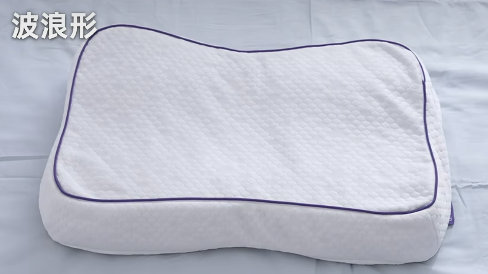

tags:: [[Shopping]]
---

- ## 枕头参数
	- ### 枕头形状
		- 长方形
		  logseq.order-list-type:: number
			- {:height 277, :width 404}
			- 最经典、最常见，价格更便宜。
			- 缺点：仅适合仰睡，侧睡时颈部悬空。
		- 波浪形
		  logseq.order-list-type:: number
			- {:height 165, :width 404}
			- 中间低，两边高，因此适应性广，适合仰睡和侧睡。
		- 异形
		  logseq.order-list-type:: number
			- {:height 277, :width 404}
			- 形状不规则。
	- ### 枕头分区
		- 通常异形枕才有分区设计。
		- 常见的分区：
			- {:height 336, :width 444}
	- ### 枕头高度
		- 枕头高度：枕头自然放置时的高度，而不是躺下后的高度。
		- 仰睡：大概是 1 拳 的高度。
		- 侧睡：大概是 1.5 拳 的高度
	- ### 枕芯材质
		- 主流材质：
			- 
			- 记忆棉
			  logseq.order-list-type:: number
				- 释压能力强，贴合度高。
				- 适合人群：颈椎不舒服的人群、长期伏案工作的上班族。
			- 乳胶
			  logseq.order-list-type:: number
				- 透气性好，柔软有弹性。
				- 缺点：有氧化发黄的问题。
				- 适合人群：肩颈没问题，追求舒适体验的人群。
			- TPE
			  logseq.order-list-type:: number
				- 透气性好，亲肤，弹性足。
				- 优点：支持全枕水洗。
			- 羽绒
			  logseq.order-list-type:: number
				- 重量轻，蓬松度高。
	- ### 枕套面料
		- 主流面料：
			- 
			- 纯棉
			  logseq.order-list-type:: number
				- 柔软舒适，吸湿性好，易打理，性价比高。
			- 冰丝/锦氨
			  logseq.order-list-type:: number
				- 透气性好，冰凉丝滑。
			- 涤纶
			  logseq.order-list-type:: number
				- 耐磨，不易皱，价格便宜。
				- 缺点：透气性和亲肤感差。
		-
- ## 参考
	- [【25年枕头购指南】耗时2个月，真人试睡30多款！](https://www.bilibili.com/video/BV11juizSE5Q/?vd_source=f1fbb083ddef12dcff3388779faac201)
	  logseq.order-list-type:: number