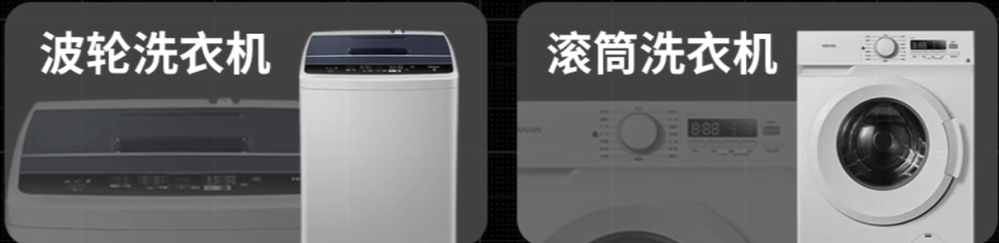

tags:: [[Shopping]]
---

- ## 洗衣机分类
	- 大分类:
		- {:height 326, :width 572}
		- 波轮
		  logseq.order-list-type:: number
		- 滚筒
		  logseq.order-list-type:: number
	- | | 波轮 | 滚筒 |
	  | ----------- | ----------- | ----------- |
	  | 洗涤原理 | 旋转, 衣物摩擦 | 提升衣物到高点, 利用重力进行摔打 |
	  | 优点 | 便宜/省电/体积小/洗涤时间短/可中途加洗涤剂或衣物 | 衣服磨损小/不易缠绕/低耗水/功能丰富 |
	  | 缺点 | 摩擦易导致衣服磨损/衣服容易缠绕/功能单一 | 贵/耗电/洗涤时间长/部分机型无法中途添加衣物  |
	  | 适合人群 | 租房/宿舍/预算不足/腰不好 的人 | 新房/预算充足/对洗衣质量有追求 的人 |
	- ==滚筒洗衣机是未来趋势==
- ## 滚筒洗衣机分类
	- 如下:
		- 单洗
		  logseq.order-list-type:: number
		- 洗烘一体
		  logseq.order-list-type:: number
		- 洗烘套装
		  logseq.order-list-type:: number
	-
- ## 波轮洗衣机选购
	- ### 容量
		- 独居: 7-8kg (日常通勤衣物/一周一次床单被罩)
		- 三口之家: 10kg
	- ### 品牌
		- 好口碑: 海尔, 小天鹅
		- 性价比: TCL
		- 高品质: 东芝, 松下
	- ### 洗净比
		- 波轮洗衣机洗净比一般在 0.8-0.9 之间.
		- 优先选择洗净比 大于等于 0.9 的机型
	- ### 脱水转速
		- 优先考虑脱水转速在 670转/min 以上的机型.
	- ### 电机类型
		- 定频 (结构简单/性能差/噪音大, 常用于低端机型)
		  logseq.order-list-type:: number
		- BLDC 变频 (性能强/噪音控制好, 常用于中高端机型)
		  logseq.order-list-type:: number
		- 直驱变频 (振动和噪音大幅降低, 不过维护成本高, 价格也高)
		  logseq.order-list-type:: number
- ## 参考
	- [【2万字解析】洗衣机选购攻略](https://www.bilibili.com/video/BV1BH3yzKEev/?vd_source=f1fbb083ddef12dcff3388779faac201)
	  logseq.order-list-type:: number
	- [【21款波轮洗衣机大横评】波轮洗衣机最全选购指南](https://www.bilibili.com/video/BV1hJb1zMEyu/?vd_source=f1fbb083ddef12dcff3388779faac201)
	  logseq.order-list-type:: number