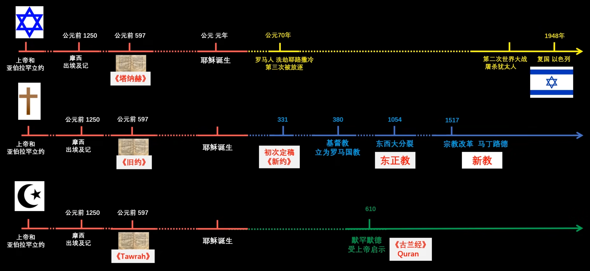

tags:: [[宗教]]
---

- ## 时间线
	- 先有的犹太教
	  logseq.order-list-type:: number
		- 亚当夏娃的后代 亚伯拉罕 ，有天被神告诉有块应许之地，在地中海东岸的迦南
		- 亚伯拉罕 有个孙子叫雅各，有天被神指引，让其改名 以色列
		- 以色列 生了十二个儿子有十二个部落，十二个部落组成以色列王国。
		- 后来以色列王国经过分裂和外族入侵，只剩下尊大卫王为正统的犹大国（大卫是以色列四子犹大的后代，此犹大和基督十二门徒的犹大不是一个，只是音译相同）。
		- 犹大国的子民经过很多年的战乱，没有忘记上帝的应许之地，回到那块土地，重建以色列国，种族被称为犹太，信奉的宗教称为犹太教（不是所有犹太人都信教）。
		- 犹太教信徒一直在等一个叫 **弥赛亚** 的人，来领导他们建立新的王国，直到今天 (2024 年 05 月 04 日 10:25:33)
	- 耶稣的故事
	  logseq.order-list-type:: number
		- 在被罗马占领时期，相传有个犹太女人生了神的儿子，名字叫耶稣。
		- 耶稣是神的儿子，经常展示神迹，所以他有很多信徒。
		- 他与耶路撒冷犹太教长老有矛盾，犹太教要杀他。
		- 耶稣被杀后复活成神，召集信徒，写下他的话。
		- 信仰耶稣的人从犹太教分裂出来，称为基督教。
		- 基督就是救世主的意思。
	- 天主教、东正教、新教。
	  logseq.order-list-type:: number
		- 罗马帝国一开始信仰基督教，后来分裂成天主教和东正教两个教派。
		- 而天主教又有抗议者，觉得原来的教义不对，分裂为新教。
		- 虽然三者都信奉耶稣基督，是基督教的不同流派，但是新教在国内可能会被直接称为基督教。
	- 
- ## 经书
	- 犹太教：只信旧约
	- 基督教：旧约新约都信
	- 伊斯兰教：只信旧约的部分内容，觉得新约是被篡改的，信奉古兰经。
-
- ## 参考：
	- [【三教极简史】困扰我多年的问题：基督，犹太，伊斯兰教的关系？](https://www.bilibili.com/video/BV1kr4y1F7M5/?vd_source=f1fbb083ddef12dcff3388779faac201)
	-