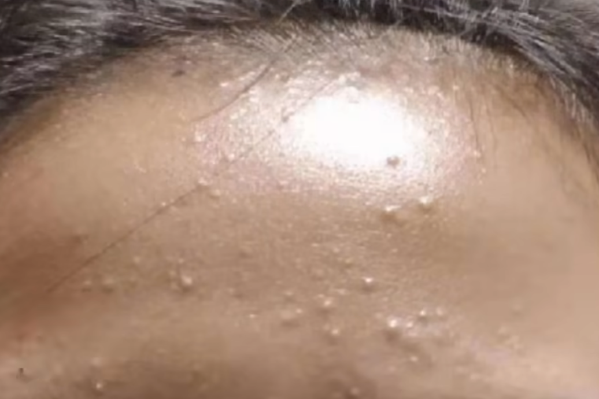
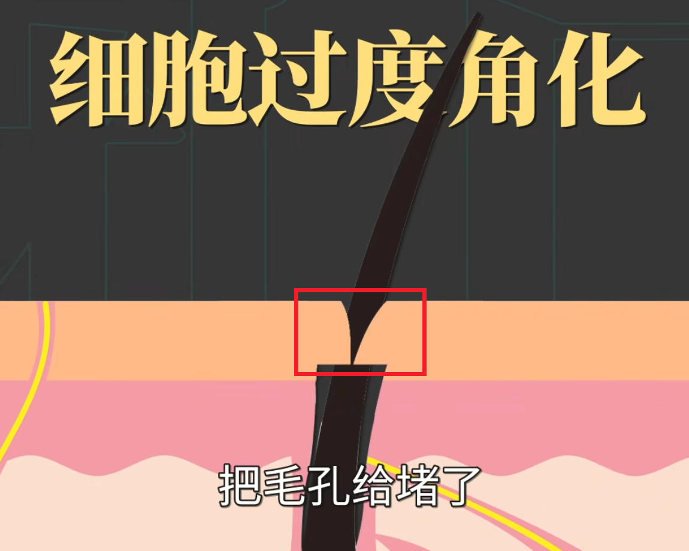
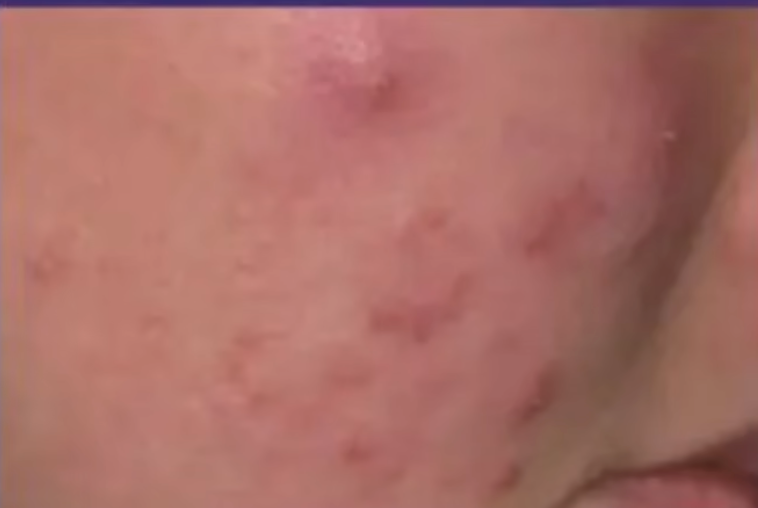
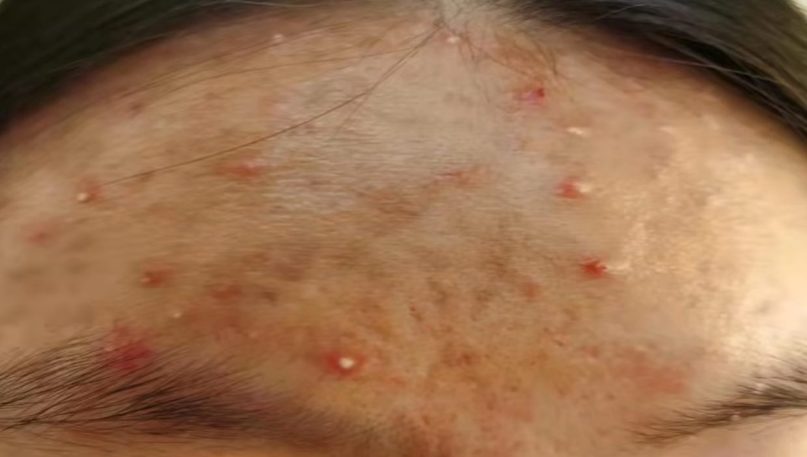
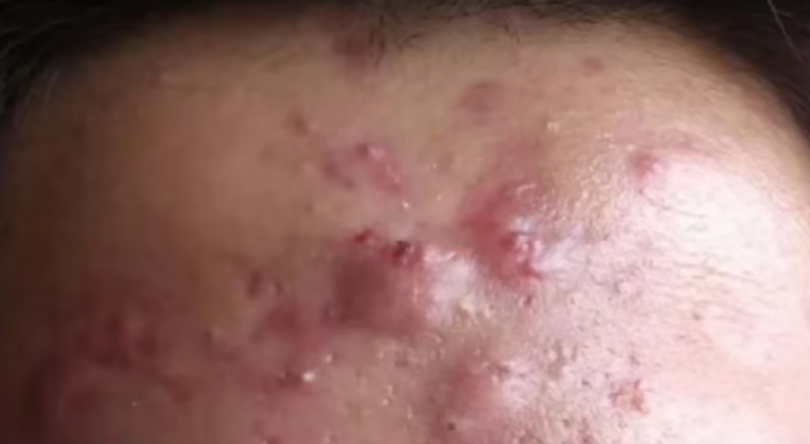

tags:: [[护肤]]
---

- > 痤疮，俗称痘痘。
- ## 痘痘的四个阶段
	- 成长期：粉刺
	- 成熟期：炎症丘疹
	- 完全体：脓疱
	- 究极体：结节囊肿
- ## 成长期: 粉刺
	- {:height 185, :width 500}
	- ### 产生原因
		- 根本原因就是 **毛孔堵塞** ，堵塞原因如下：
		- 细胞过度角化。
		  logseq.order-list-type:: number
			- 即毛囊口角质形成细胞过度角化，导致毛孔堵塞，进而导致皮脂混合物分泌不出去，导致皮肤隆起小包，即粉刺。
			- 过度角化的原因有：
				- 化妆品等的外部刺激。
				- 痤疮丙酸杆菌等微生物将皮脂中的甘油三酯分解为游离脂肪酸，刺激细胞过度角化。
					- 所以油皮容易长痘。
			- {:height 143, :width 540}
		- 皮脂过度分泌。
		  logseq.order-list-type:: number
			- 皮脂过度分泌，堵塞了毛孔深部，导致皮肤隆起小包，即粉刺。
	- ### 闭口粉刺与黑头粉刺
		- 如果毛孔阻塞位置的皮脂混合物能与外界接触氧化，就会变成 **黑头粉刺**。
		- 如果不能，就是 **闭口粉刺** 。
- ## 成熟期: 炎症丘疹
	- {:height 376, :width 536}
- ## 完全体: 脓疱
	- {:height 129, :width 553}
- ## 究极体: 结节囊肿
	- {:height 155, :width 559}
-
- ## 祛痘
	- 总体就两个方向：
		- 清除角化细胞、阻止细胞过度角化、。
		  logseq.order-list-type:: number
		- 清除皮脂、阻止皮脂过度分泌。
		  logseq.order-list-type:: number
			- 主要就是 **雄性激素** 水平。
			-
	-
- ## 参考
	- [【皮肤科】全类型痘痘攻克指南](https://www.bilibili.com/video/BV17i4y1w7a5/?vd_source=f1fbb083ddef12dcff3388779faac201)
	  logseq.order-list-type:: number
	- [医学博士：如何才能清除痘痘 I 青春痘是怎么来的？I 解决你的痘痘困扰](https://www.bilibili.com/video/BV1EZ4y1x7XQ/?vd_source=f1fbb083ddef12dcff3388779faac201)
	  logseq.order-list-type:: number
-