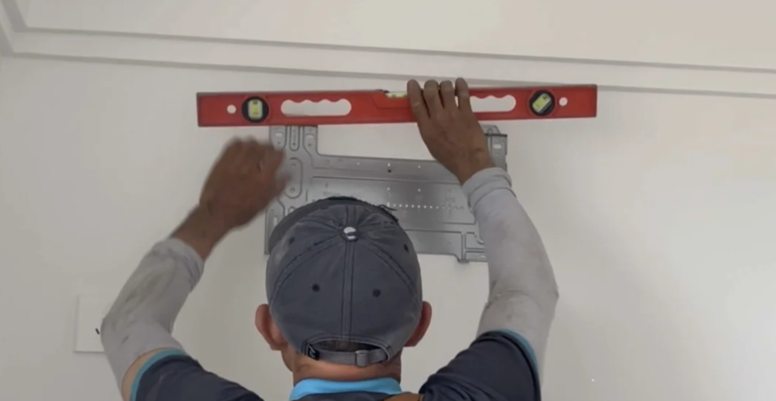
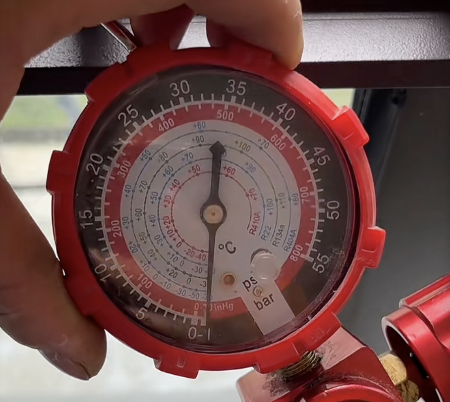

tags:: [[Shopping]]
---

- ## 空调原理
- ## 空调参数
	- ### 匹数
		- 1 匹 约等于 2600W 制冷量
		- 1.5 匹 约等于 3500W 制冷量
		- 3 匹 约等于 7200W 制冷量
		- 匹数越大, 制冷能力越强, 降温越快.
	- ### 外机
		- #### 冷凝器
			- 主要看铜管的:
				- 排数 (越多散热面积越大, 优先考虑双排铜管)
				  logseq.order-list-type:: number
				- 管径 (一般有 7mm 和 5mm 两种规格, 越粗散热面积越大)
				  logseq.order-list-type:: number
				- 长度
				  logseq.order-list-type:: number
		- #### 节流装置
			- 用来调节冷媒流速
			- 目前有如下几种:
				- 电子膨胀阀 (精准控制冷媒流速, 虽然成本会贵 100 块, 但还是优先选择这种)
				  logseq.order-list-type:: number
				- 毛细管 (控温精准度较差, 更耗电)
				  logseq.order-list-type:: number
	- ### 内机
		- #### 蒸发器
			-
- ## 安装注意事项
	- 询问是否有安装费/高空费/材料费.
	  logseq.order-list-type:: number
	- 内机左右两侧离墙至少  15 cm , 离天花板至少 15 cm .
	  logseq.order-list-type:: number
	- 打孔需要内高外低, 防止雨水倒灌.
	  logseq.order-list-type:: number
	- 内机水管要向下伸出屋外, 便于排水.
	  logseq.order-list-type:: number
	- 内机支架要用水平仪测量是否水平.
	  logseq.order-list-type:: number
		- {:height 405, :width 415}
	- 内机金属片倒入水, 观察外部管道是否排水正常.
	  logseq.order-list-type:: number
	- 外机抽真空至少 15 分钟, 抽完后保持在负压 2 分钟不反弹.
	  logseq.order-list-type:: number
		- {:height 405, :width 352}
	-
- ## 参考
	- [【23款省电空调大横评】省电空调最全选购攻略](https://www.bilibili.com/video/BV1Euu2zKETo/?vd_source=f1fbb083ddef12dcff3388779faac201)
	  logseq.order-list-type:: number
	- logseq.order-list-type:: number