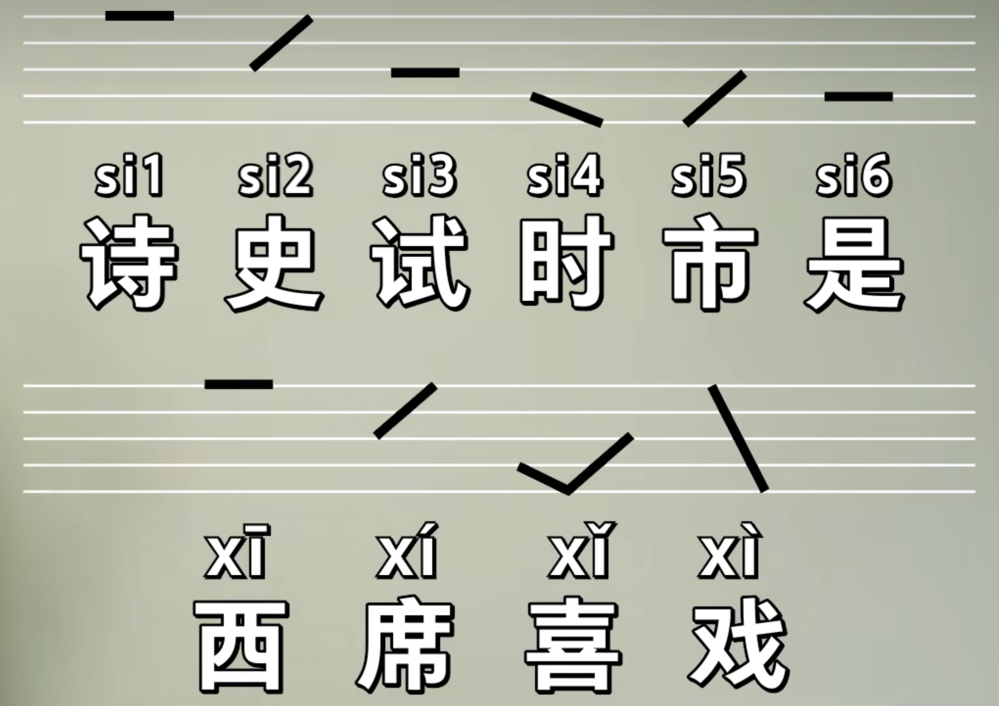
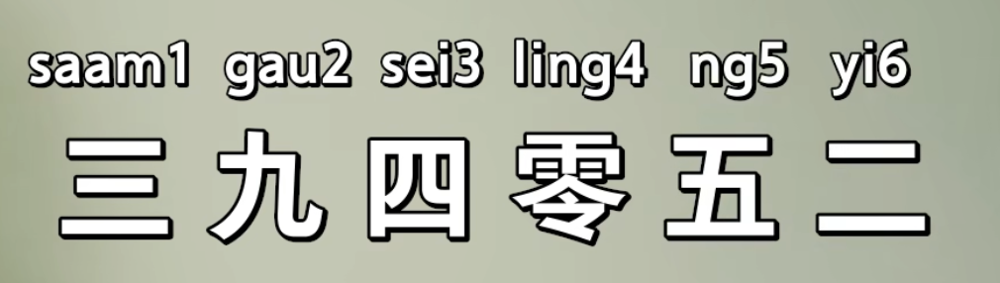

## 九声六调与汉语拼音声调
	- {:height 305, :width 442}
	- | 粤语声调序号 | 粤语声调分类 | 粤语声调名称 | 等价的普通话声调 |
	  |----------|----------|----------|
	  | 1 | 舒声 | 阴平 | 1 声 |
	  | 2 | 舒声 | 阴上 | 2 声 |
	  | 3 | 舒声 | 阴去 | 2 声 保持起始音调不变调 |
	  | 4 | 舒声 | 阳平 | 3 声 的转音的前半部分 |
	  | 5 | 舒声 | 阳上 | 3 声 的转音的后半部分 |
	  | 6 | 舒声 | 阳去 | 3 声 保持起始音调不变调 |
	  | 7 | 入声 | 阴入 | 粤语 1 声加上 -p |
	  | 8 | 入声 | 中入 | 粤语 3 声加上 -t |
	  | 9 | 入声 | 阳入 | 粤语 6 声加上 -k |
	-
- ## 六调记忆口诀
	- 
	- 记住这 6 个数字的读法，根据他们的升调推断其他字的升调。
- ## 参考
	- [粵拼官方教程 - 識普拼，學粵拼](https://jyutping.org/docs/cantonese/)
	  logseq.order-list-type:: number
	- [九声六调其实没那么复杂！用汉语拼音学粤语声调 | 婕斯敏的粤语小教室 39](https://www.bilibili.com/video/BV16P4y1x7LC/?vd_source=f1fbb083ddef12dcff3388779faac201)
	  logseq.order-list-type:: number
		- [懂得普通話的 4 聲調, 就可掌握廣東話的 9 聲 6 調？](https://www.youtube.com/watch?v=DfFyeKduNXc&t=346s)
		  logseq.order-list-type:: number
	- [【粤语学习】九声六调 一次学会！粤语基础](https://www.bilibili.com/video/BV1kL4y1a7PD/?vd_source=f1fbb083ddef12dcff3388779faac201)
	  logseq.order-list-type:: number
	- logseq.order-list-type:: number