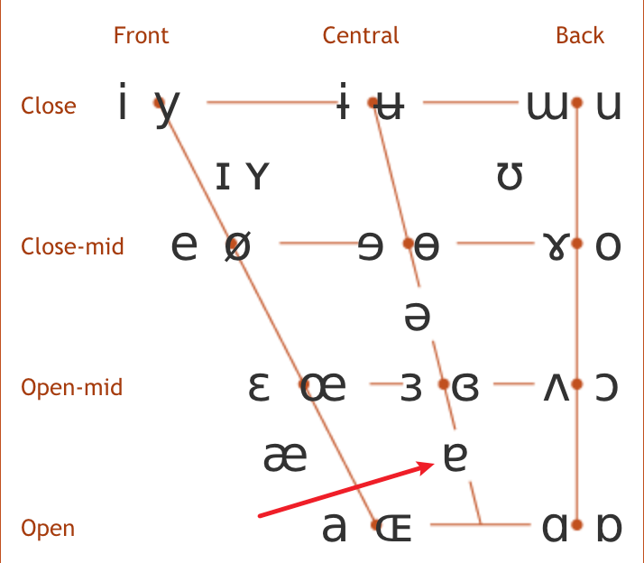

tags:: [[粤语]]
---

- ## 如何学习
	- 粤拼官方: [粵拼：香港語言學學會粵語拼音方案](https://jyutping.org/zh-cmn-hant/jyutping/)
		- 粤拼方案中用 **国际音标** 标注发音，可在这里查询相应国际音标的发音:
			- [[IPA]]
			- [英语兔 - 这才是正版国际音标(IPA)! ](https://www.bilibili.com/video/BV1QA411i7Yf?p=1&vd_source=f1fbb083ddef12dcff3388779faac201)
	- 粤拼官方与汉语拼音的比较: [我只會普通話拼音](https://jyutping.org/zh-cmn-hant/docs/mandarin/)
- ## aa、a 与 e
	- 参考: [韻腹 aa 和 a](https://jyutping.org/zh-cmn-hant/docs/mandarin/#21-%E9%9F%BB%E8%85%B9-aa-%E5%92%8C-a)
	- ### aa
		- 粤拼的 aa 与 普拼的 a 发音一致
	- ### a
		- 粤拼的 a 发国际音标的 [ɐ] ，这个音比中央元音 [ə] 舌位低一些。
			- {:height 230, :width 251}
	- ### e
		- 与普通话 `也` 的韵母一致。
- ## ei 和 ai 的区别
- ## au、eu 和 ou 的区别
	- au 和 ou 可能分别对应英语 DJ 音标中的 /əʊ/ 与 /oʊ/ ?
	-