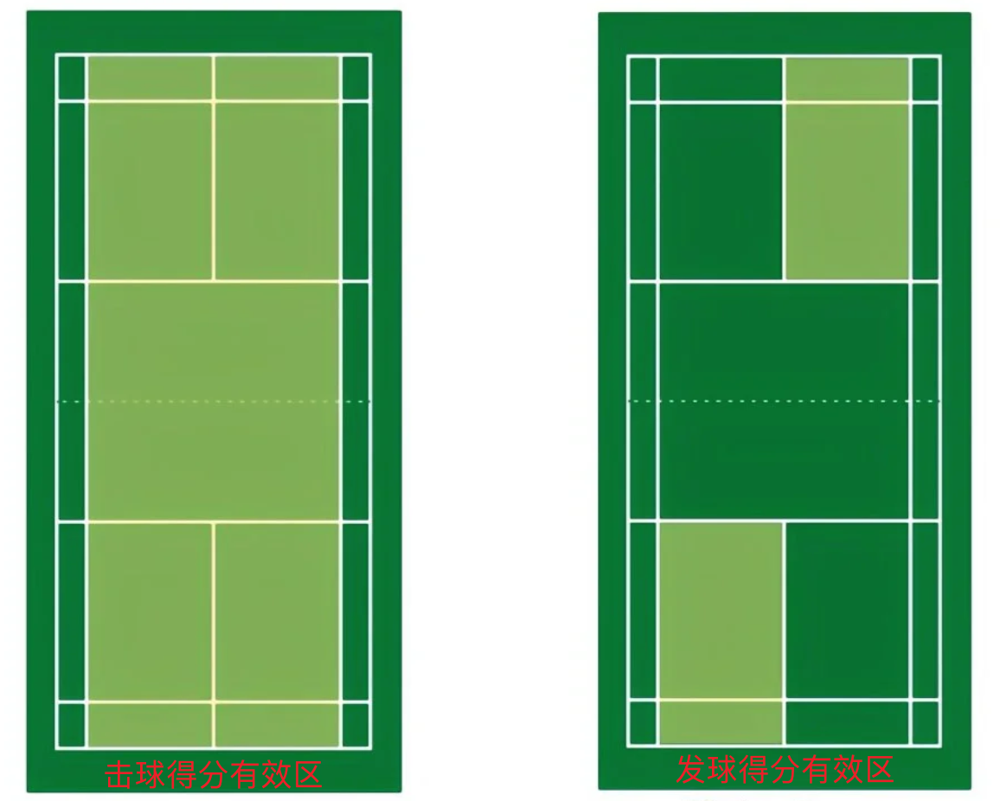

tags:: [[Sport]]
---

- ## 发球与得分规则
	- 参考:
		- [羽毛球运入门需要懂的边线与发球规则](https://www.xiaohongshu.com/explore/6458fcb9000000001203f9d7)
		  logseq.order-list-type:: number
	- ### 总原则
		- 球落在己方一侧的得分有效区内 (压线算界内)，则对方得 1 分。
		  logseq.order-list-type:: number
		- 谁得分，谁发球。
		  logseq.order-list-type:: number
		- 单左双右。
		  logseq.order-list-type:: number
			- 己方得分为单数，则在左半区发球，需要发到右半区；
			- 己方得分为双数 (包括 0)，则在右半区发球，需要发到左半区；
	- ### 单打规则
		- 继承上述总原则。
		- 单打得分有效区如下：
			- {:height 257, :width 380}
	- ### 双打规则
		- 除继承上述总原则之外，双打还有一个额外的规则：
			- 如果当前得分的回合，发球方是己方；则下一回合，己方发球人换半区 (左右半区)，继续发球。
			- 如果当前得分的回合，发球方是对方；则下一回合，己方两人位置不变，按得分奇偶选择发球人。
		- #### 从单个球员的视角来看
			- 找一下规律可知，在我方得分时：
				- 如果是我发球得分，则我要换个位置，继续发球。
				- 如果是队友发球得分，则队友要换个位置，继续发球，我根据战术选择站位 (一般会换到队友那边)。
				- 如果是对方发球，我方得分；
					- 如果我方上次发球人是我，则这次由队友发球 (不换位置)；
					- 如果我方上次发球人是队友，则这次由我发球 (不换位置)；
					- 如果我方从未发过球，则说明我方此时分数为 1 分 (因为如果是 2 分及以上，那么一定发过球)，那么由左边的人发球 (不换位置)。
		- 双打得分有效区如下：
			- {:height 257, :width 380}
- ## 术语
	- rally : 从发球，双方击球，到球落地的过程 (个人感觉可翻译为 **回合** )
	- stroke: 一个球拍击球的动作
	- server: 发球方
	- receiver: 接球方
	- 得分播报时，貌似都是将此次得分方的分数放在前，另一方在后。
- ## 参考
	- 国际羽毛球联合会 (Badminton World Federation) 2024年最新羽毛球比赛规则: [BWF STATUTES](https://corporate.bwfbadminton.com/statutes/) > [LAWS OF BADMINTON](https://extranet.bwf.sport/docs/document-system/81/1466/1470/Section%204.1%20-%20Laws%20of%20Badminton%20-%2027%20Apr%202024%20V3.0.pdf)
	  logseq.order-list-type:: number
	- 国际羽毛球联合会 (Badminton World Federation) 羽毛球比赛简化规则: [Simplified Rules of Badminton](https://system.bwfbadminton.com/documents/folder_1_81/Regulations/Simplified-Rules/Simplified%20Rules%20of%20Badminton%20-%20Dec%202015.pdf)
	  logseq.order-list-type:: number
	- [国际羽毛球联合会 (Badminton World Federation) 2024年最新羽毛球比赛规则 - 中文翻译](http://www.vxixi.com/)
	  logseq.order-list-type:: number
-