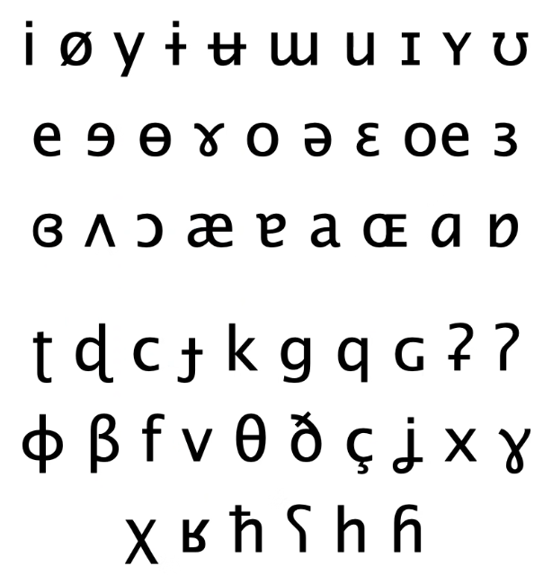
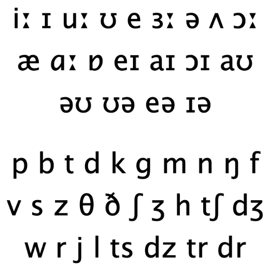
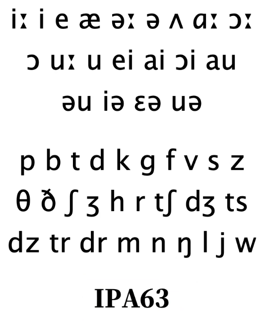
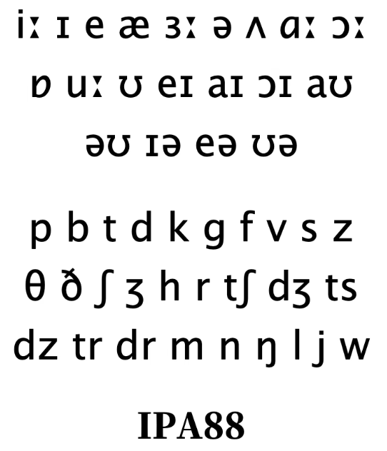
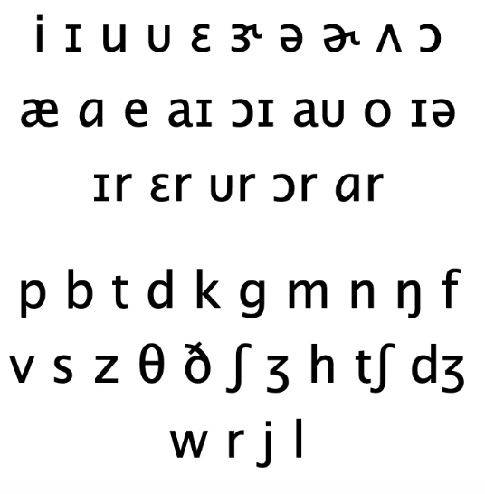

tags:: [[英语音标]]
---

- ## 音标体系
	- ### 国际音标
		- IPA (International Phonetic Alphabet) 。
		- 被一群语言学家发明出来，给所有语言注音。
		- 
	- ### DJ 音标 (英式)
		- #### DJ 音标来源
			- 名字源于 Daniel Jones (丹尼尔·琼斯) 。
				- *这个名字中的点，Mac 上要用 `Option + Shift + 9` 打出来*
			- 在他出版的《英语发音词典》( *English Pronouncing Dictionary* ) 中，从国际音标中借鉴符号，为当时的 **标准英式英语 (RP : Received Pronunciation)** 注音，改动不大。
			- {:height 432, :width 420}
			- 在国内，以讹传讹，DJ 音标被称为国际音标。
		- #### IPA63音标
			- 《英语发音词典》1963年版本的音标。
			- *被称为 IPA 其实不太对，因为他不是 IPA*
			- 
		- #### IPA88 音标 / Gimson 音标
			- 《英语发音词典》1988年版本的音标，由 DJ 的学生 A.C.Gimson 修订，与 IPA63 区别不大。
			- **这是现今常见的所谓的 IPA 新版本** 。
			- 
	- ### KK 音标 (美式)
		- 名字源于 (John **K**enyon 和 Thomas **K**nott) 。
		- 这两个人编撰了 《美国英语发音词典》( *A Pronouncing Dictionary of American English* )，注音符号也大多来源于国际音标，但其中一些符号更方便标注美式英语的发音。
		- 
		- KK 音标基本只在 **台湾** 地区广泛使用，即使在美国本土，都用得比较少。
	- ### 韦氏音标
		- 韦氏词典 (Webster's Dictionary) 使用的音标。
		- *很多美国人从小到大大多用的是这本词典，所以对 韦氏音标 比较熟悉* 。
		- ==美国人可能看不懂 DJ 和 KK 音标。==
	- ### AHD 音标
		- 《美国传统英语词典》 (**A**merican **H**eritage **D**ictionary) 使用的音标。
- ## 母语者音标普及率
	- 实际上，英美国家 音标普及率，远没有我们拼音普及率高。大多数母语者任何一种音标都看不懂。
	- 母语者通常采用 **Respelling** 的方式去注音，说白了就是用常用词去标注词的读音。
		- 如: diarrhoea (DYE-uh-REE-uh)
- ## 建议学习哪种音标
	- 建议学习 DJ 音标
		- 因为它被国内的主流词典使用: 牛津词典, 朗文词典, 剑桥词典等。
	- DJ 音标虽然一开始用于标注英式英语，但它标注美式英语也毫无压力，所以也可以用它来学习美式英语。
- ---
- ## 参考资料
	- [B站英语兔](https://www.bilibili.com/video/BV1iV411z7Nj/?p=2&vd_source=f1fbb083ddef12dcff3388779faac201)