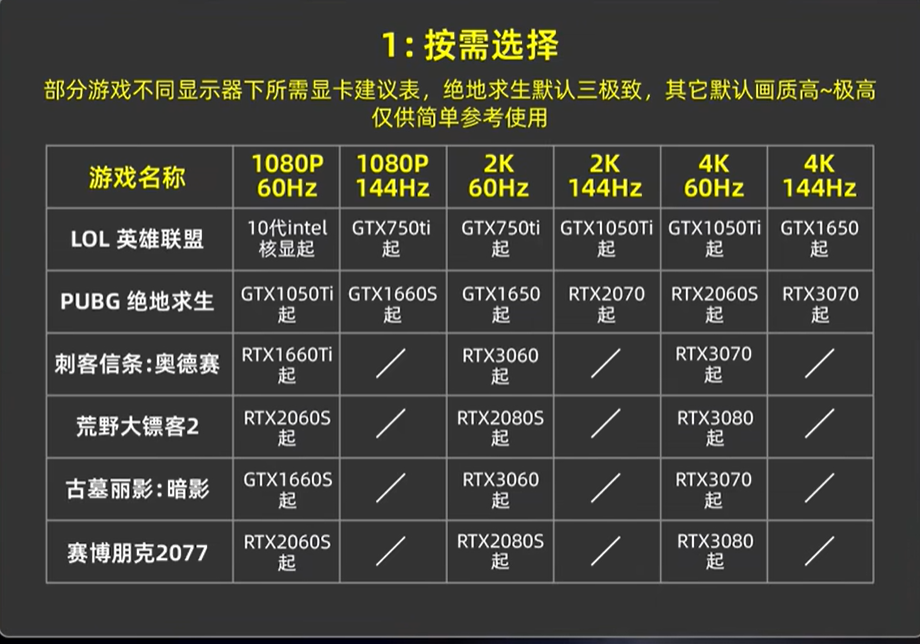
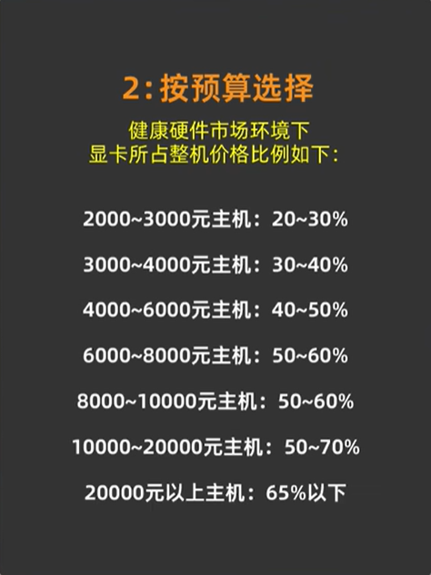
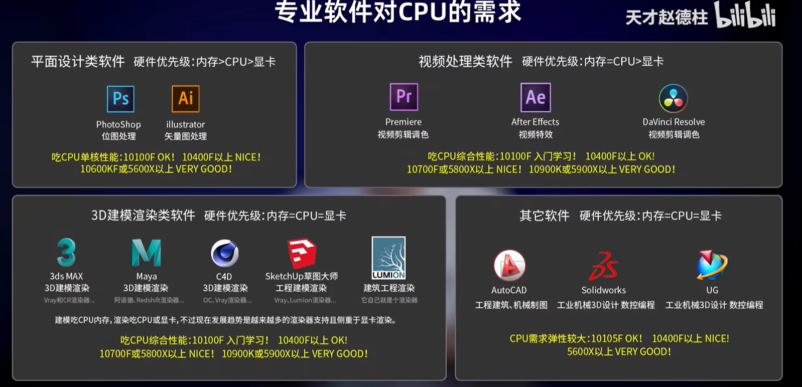

tags:: [[Shopping]]
---

- ==本笔记记录时间 2022.05==
- ## 最终购买
	- | 硬件 | 型号                                                         | 价格    |
	  | ---- | ------------------------------------------------------------ | ------- |
	  | 显卡 | 七彩虹（Colorful）火神 iGame GeForce RTX 3060 Ti Vulcan OC 8G LHR | 3999.00 |
	  | CPU  | 英特尔（Intel）12代 酷睿 i7-12700                            | 2239.19 |
	  | 主板 | 华硕（ASUS）TUF GAMING B660M-PLUS WIFI D4重炮手              | 1199.00 |
	  |      |                                                              |         |
	- 显卡 + 主板 实付：4674.00，即优惠了 3999.00 + 1199.00 - 4674.00 = 524。
- ## 购买建议
	- ### 在哪购买
		- **显卡** 和 **电源** 在 **京东** 购买，更放心。
		  logseq.order-list-type:: number
		- **京东** 开通plus会员很划算。
		  logseq.order-list-type:: number
		- 其他配件比较 **京东** 和 **淘宝** 价格后购买，二手平台慎考虑。
		  logseq.order-list-type:: number
- ## 显卡
	- ### 御两家
		- NVIDIA
		- AMD
		- ==Intel目前只生产集成在CPU中的显卡==
	- ### 公版显卡与非公显卡
		- 如御两家类似的厂家，生产的各型号 **显卡核心** 称为 **公版显卡** 。
			- 如 NVIDIA 的 **RTX 3060Ti** 、 **RTX 3070** 、 **RTX 3070Ti** 等（其中 RTX 意为 Ray Tracing Texel eXtreme）
			- 如 AMD 的 **RX 6600 XT** 、 **RX 6700 XT** 、 **RX 6800** 等
		- 基于 **公版显卡** 生产的各种款式的显卡称为 **非公显卡** 。
			- NVIDIA 称生产 **非公显卡** 的合作伙伴为 AIC（Add-In-Cards），如  **华硕** **微星** **七彩虹** 等
			- AMD 称生产 **非公显卡** 的合作伙伴为 AIB （Add-In-Board），如  **华硕** **微星** **七彩虹** 等
		- 基于同一  **公版显卡** 生产 **非公显卡** 可能有不同的价格档次，但是由于显卡核心相同，所以即便是旗舰款和丐版，性能差别也不是很大；所以如果没有对这方面追求不是太高或预算有限，可以直接选择丐版，丐版性价比很高。
		- {:height 504, :width 830}
	- ### 显卡天梯图
		- [快科技显卡天梯图网址](https://www.mydrivers.com/zhuanti/tianti/gpu/)
		- [秋刀鱼半藏显卡天梯图网址](https://tieba.baidu.com/p/6133450546?see_lz=1#135699450528l)
	- ### 主流显卡
		- 
	- ### 如何选择
		- #### 游戏玩家
			- ##### 按需选择
				- 根据想玩的 **游戏** 和 **显示器** 选择，前提是 CPU 与 内存 都不短板。（绝地求生三极致是指： **纹理** 、 **抗锯齿** 和 **可视距离** 调到极致）
				- {:height 499, :width 639}
			- ##### 按预算选择
				- {:height 346, :width 243}
			- ##### A卡还是N卡
				- 如果追求极致光追体验，选N卡（因为N卡在硬件层面实现的光追技术，比A卡软件层面实现的光追更强）
				- 如果不追求光追，选性价比高的即可。
		- #### 专业需求人群
			- 生产力需求建议买 N卡。
			- {:height 421, :width 849}
- ## CPU
	- ### 御两家
		- Intel
		- AMD
	- ### 核心数与线程数
		- 8核16线程 **约等于** 10核（超线程提升约20~25%）
	- ### CPU频率
		- 基础频率：
		- 加速频率：
		- 并非所有线程都能达到 **加速频率** ，同一时间最多 1~2个线程。
		- 主频：正常频率，如浏览网页
		- 睿频：高负荷频率，如打大型游戏、3D渲染等
		- 超频：加电压让所有线程都达到加速频率（提升并不大，新手建议不要考虑这个）
	- ### IPC
		- IPC：可以理解为效率，与CPU架构（指令设计）相关。
	- ### CPU型号
		- 
		- AMD ZEN2 不推荐，预算有限的可以考虑 2700X 以上的。
		- AMD ZEN3 游戏性能不错，推荐！
		- intel 10代，游戏性能不差，专业需求也能胜任，推荐！
		- intel 11代，甚至不如10代，不推荐！
		- [Intel 处理器型号数字和字母含义解析](http://www.360doc.com/content/22/0501/15/75017606_1029271320.shtml)
	- ### 盒装与散片
		- {:height 388, :width 499}
	- ### 购买建议
		- #### 游戏玩家
			- {:height 379, :width 699}
		- #### 专业需求人群
			- {:height 493, :width 804}
- ## 主板
	- ### 御两家
		- 华硕
		- 微星
	- ### 版型
		- ATX （大板）
		- MATX
			- 标准 MATX（中板）
			- 阉割 MATX（小板，阉割了两个内存插槽和一个PCIE插槽）
		- ITX（迷你板，特殊版型）
		- **一般 高端芯片组做大板，中端芯片组做中板，低端芯片组做小板 ，但也有例外。**
		- **AMD 和 intel 每发布一代新的 CPU ，都会随之发布新的芯片组**
		- **芯片组决定了主办的级别和档次。**
	- ### 常见芯片组
		- {:height 453, :width 880}
		  id:: 66cadf64-e086-49d9-a9d9-f8ca0fe801ed
	- ### 搭配建议
		- 
	- ### 主板总线
		- 除了黄色部分是与 **CPU** **直连** ，其他线路都是通过 **南桥芯片组** 与间接与 **CPU** 连接。
		- **CPU** 与 **南桥芯片组** 通过 **DMI总线** 连接，目前流行的 **DMI总线** 也是使用 **PCIE** 通道。
		- {:height 527, :width 786}
		- PCIE 长度是物理长度。
		- 而实际使用的通道数，是由 **实际使用的触电数** 决定（所以，即便有X16的物理长度、且有X4的触点，但可能只用了X1的通道数）。
		- {:height 593, :width 667}
	- ### USB
		- #### 混乱的命名
			- {:height 462, :width 762}
			  id:: 66cae011-d31b-4eb3-9692-fb808f44c2c6
		- #### 统一图标
			- {:height 440, :width 767}
	- ### intel600 系芯片组
		- {:height 440, :width 714}
	- ### 接口、总线与协议
		- 传输速率取决于 **总线**
		- {:height 402, :width 765}
- ## 内存
	- ### 内存颗粒御三家
		- 三星
		- 镁光
		- 海力士
	- ### 颗粒
		- {:height 509, :width 636}
	- ### 新手购买建议
		- {:height 492, :width 712}
- ## 硬盘
	- ### 固态硬盘分类
		- {:height 419, :width 783}
		- TLC颗粒
	- ### 机械硬盘
		- 只买CMR
- ## 电源
	- ### 电源认证
		- {:height 300, :width 927}
	- ### 尺寸
		- ATX比较主流，其他都是主要用于ITX主板
		- {:height 320, :width 543}
	- ### 模组
		- 直出
		- 半模组
		- 全模组
	- ### 购买建议
		- #### 瓦数
			- 选购时一元一瓦比较好。
			- {:height 388, :width 757}
			- {:height 456, :width 771}
		- #### 品牌
			- {:height 215, :width 803}
- ## 散热器
	- ### 分类
		- {:height 298, :width 720}
	- ### 推荐搭配
		- {:height 476, :width 724}
- ## 机箱
	- #### 购买需注意的问题
		- 主板大小
		- 显卡长度
		- 散热器高度
		- 电源长度
		- 硬盘位数量
		- 是否焖罐
		- 下置电源
- ## 机箱风扇
	- ### 主流 12cm 风扇
		- {:height 411, :width 536}
		- 其中小4pin最高级
		- 除非机箱自带 **大4D接口风扇** 或 **小3pin接口风扇** ，否则一律建议购买 **小4pin接口风扇** 。
		- {:height 395, :width 592}
- ## 显示器
	- ### 尺寸
- ## 键盘
	- [[键盘选购]]
- ## 鼠标
- ---
- ## 参考
	- 新手装机相关 ----- 天才赵德柱： https://space.bilibili.com/151155077/video
	  PCIE相关 ----- 硬件茶谈： https://space.bilibili.com/14871346/search/video?keyword=pcie
	  USB相关 ----- 天才赵德柱： https://www.bilibili.com/video/BV12q4y1a7Q2?spm_id_from=333.337.search-card.all.click
	  有关接口、总线与协议 ----- 硬件茶谈： https://www.bilibili.com/video/BV1Qv411t7ZL?spm_id_from=333.999.0.0
	  硬盘相关 ----- 硬件茶谈： https://space.bilibili.com/14871346/search/video?keyword=%E7%A1%AC%E7%9B%98
	-