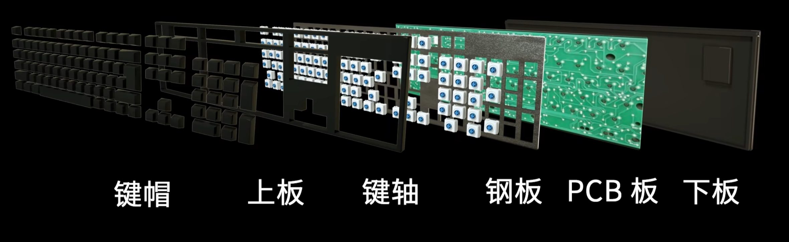

tags:: [[Shopping]]
---

- ## 键盘的组成
	- 
- ## 键轴
	- ### 什么是键轴
		- 键盘轴，本质上就是一个开关。
	- ### 键轴分类
		- 接触式
			- ==机械键盘== (高端)
			- 薄膜键盘 (廉价)
			- 导电橡胶式键盘 (机械手感的薄膜键盘)
		- 非接触式
		  id:: 65e74ae0-345c-4a67-8c61-dfe3085e709d
			- 静电容键盘 (最高科技、昂贵)
	- ### 机械轴
		- [[机械轴选购]]
- ## 键帽
	- ABS 苯乙烯树脂 (便宜，容易打油)
	- PBT (不易打油，稍贵)
	- 金属
	- 木质
- ## 键盘品牌
	- 国际大牌：
		- Cherry 樱桃
		- Logitech 罗技
		- SteelSeries 赛睿
		- Filco 斐尔可
		- Leopold 利奥博德
		- Razer 雷蛇
		- Microsoft 微软
	- 国产较好的品牌:
		- ikbc
		- ducky
		- akko
		- 高斯
	- 国产一般的品牌:
		- 雷柏
		- 达尔优
- ## 参考
	- [B站最详细的键盘科普，看完再选购键盘事半功倍](https://www.bilibili.com/video/BV187411a7YF/?spm_id_from=333.337.search-card.all.click&vd_source=f1fbb083ddef12dcff3388779faac201)